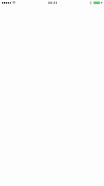

# Radar Animation | CAShapeLayer derivative
A CAShapeLayer derivative producing radar like animation

[![Swift Version][swift-image]][swift-url]
[](http://cocoapods.org/pods/LFAlertController)
[](http://makeapullrequest.com)



## Features

- [x] Cutomizabale color
- [x] Customizable diameter
- [x] Customizable start diameter

## Requirements

- iOS 9.0+
- Xcode 9.0

## Installation

#### Manually
1. Download and drop ```RadarAnimationLayer.swift``` in your project.
2. Congratulations!  

## Usage example

```swift

let radarAnim = RadarAnimationLayer()

radarAnim.animationDuration = 2.0
radarAnim.color = UIColor.brown

radarAnim.animate(startPoint: sender.location(in: self.view),
                    diameter: 160.0,
                    containerLayer: self.view.layer)

radarAnim.animate(startPoint: sender.location(in: self.view),
                    diameter: 160.0,
                    containerLayer: self.view.layer,
                    startDiameter: 60)

```

## Contribute

We would love you for the contribution to **Radar Animation**.

[swift-image]:https://img.shields.io/badge/swift-4.0-orange.svg
[swift-url]: https://swift.org/
[license-image]: https://img.shields.io/badge/License-MIT-blue.svg
[license-url]: LICENSE
[codebeat-image]: https://codebeat.co/badges/c19b47ea-2f9d-45df-8458-b2d952fe9dad
[codebeat-url]: https://codebeat.co/projects/github-com-vsouza-awesomeios-com
